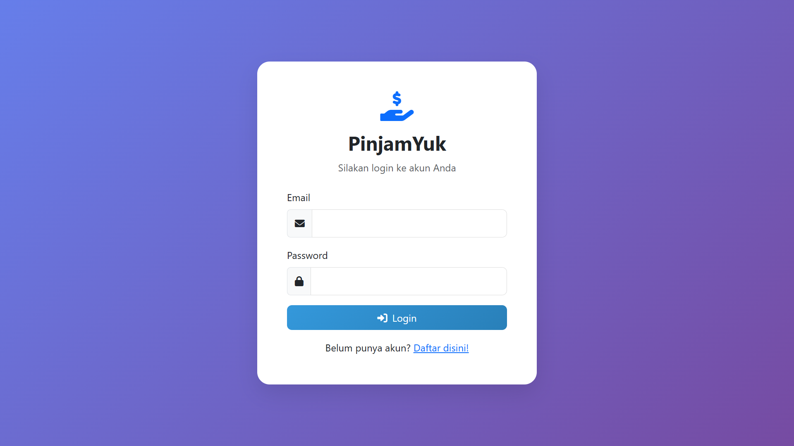
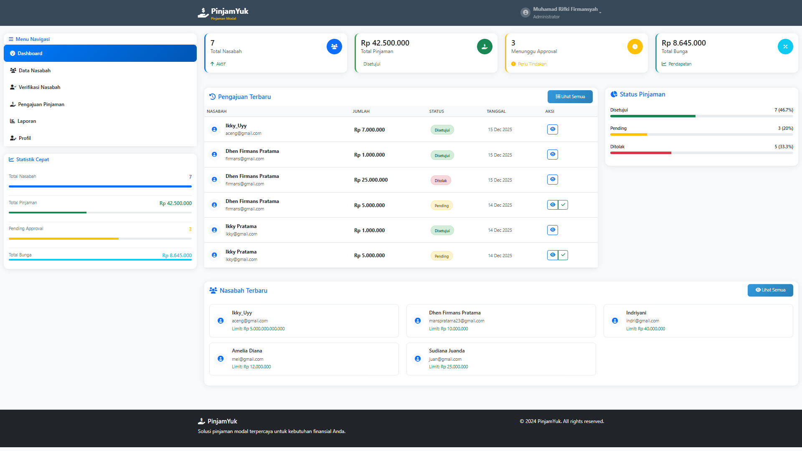
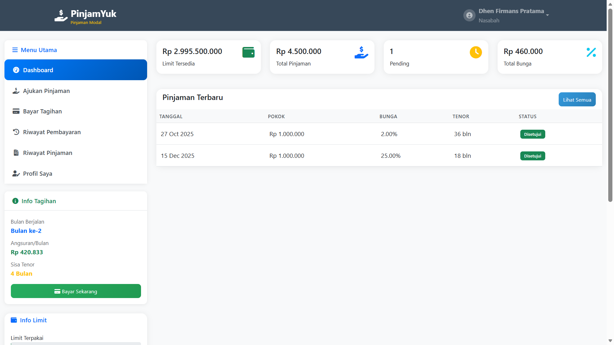

# 💸 PinjamYuk – Aplikasi Web Pinjaman Modal

PinjamYuk adalah aplikasi berbasis web yang digunakan untuk manajemen pinjaman modal. Aplikasi ini memiliki dua peran utama, yaitu **Admin** dan **Nasabah**, yang masing-masing memiliki hak akses dan fitur berbeda. Sistem ini dirancang untuk mempermudah proses pengajuan pinjaman, perhitungan bunga, hingga pelaporan pinjaman secara terstruktur dan efisien.

Aplikasi ini dikembangkan sebagai **project pembelajaran / tugas kuliah** berbasis web.

---

## ✨ Fitur Utama

### 👨‍💼 Fitur Admin
- Dashboard admin dengan statistik pinjaman
- Manajemen data nasabah
- Verifikasi dan approval pengajuan pinjaman
- Manajemen data pinjaman
- Laporan pinjaman dan cetak laporan
- Manajemen profil admin

### 👤 Fitur Nasabah
- Dashboard nasabah (informasi limit & status pinjaman)
- Pengajuan pinjaman secara online
- Kalkulator pinjaman
- Simulasi angsuran
- Riwayat pinjaman
- Pembayaran tagihan
- Manajemen profil nasabah

### 🧮 Fitur Perhitungan
- Perhitungan bunga otomatis
- Sistem diskon
- Limit pinjaman
- Simulasi angsuran bulanan

---

## 🛠️ Teknologi & Bahasa Pemrograman

Aplikasi **PinjamYuk** dibangun menggunakan teknologi berikut:

- **Backend:** PHP (Native)
- **Database:** MySQL
- **Frontend:** HTML5, CSS3, JavaScript
- **Web Server:** Apache (XAMPP / Laragon)
- **Tools Pendukung:** phpMyAdmin, Web Browser

---

## 📁 Struktur Folder


---

## 🖼️ Tampilan Aplikasi

Bagian ini menampilkan screenshot halaman utama aplikasi untuk memberikan gambaran visual mengenai alur penggunaan sistem.

### Halaman Login
Halaman login digunakan oleh admin dan nasabah untuk masuk ke dalam sistem dengan memasukkan email dan password yang valid.



### Dashboard Admin
Dashboard admin berfungsi sebagai pusat pengelolaan sistem, menampilkan statistik pinjaman serta menu manajemen data nasabah, pengajuan pinjaman, dan laporan.



### Dashboard Nasabah
Dashboard nasabah menampilkan informasi pinjaman yang dimiliki, seperti limit pinjaman, status pengajuan, dan riwayat pinjaman.



---

## 🚀 Instalasi

Ikuti langkah-langkah berikut untuk menjalankan aplikasi:

1. **Download / Clone Project**
   - Simpan folder project ke direktori:
     - `htdocs` (XAMPP) atau
     - `www` (Laragon)

2. **Import Database**
   - Buat database dengan nama `pinjamyuk`
   - Import file `pinjamyuk.sql`

3. **Konfigurasi Database**
   - Edit file `config/database.php`
   - Sesuaikan konfigurasi host, username, dan password database

4. **Jalankan Aplikasi**
   - Buka browser
   - Akses:
     ```
     http://localhost/pinjamyuk
     ```

---

## 🔐 Akun Login Default

### Admin
- Email: `admin@pinjamyuk.com`
- Password: `123456`

### Nasabah
- Email: `nasabah@pinjamyuk.com`
- Password: `123456`

---

## 📌 Catatan

- Aplikasi ini dibuat untuk **keperluan pembelajaran / tugas kuliah**
- Data yang digunakan masih bersifat **dummy**
- Aplikasi belum di-deploy ke server hosting

---

## 👨‍💻 Author

**Muhammad Rifki Firmansyah**
**221011400825**

Jika repository ini bermanfaat, jangan lupa ⭐ sebagai bentuk dukungan.


